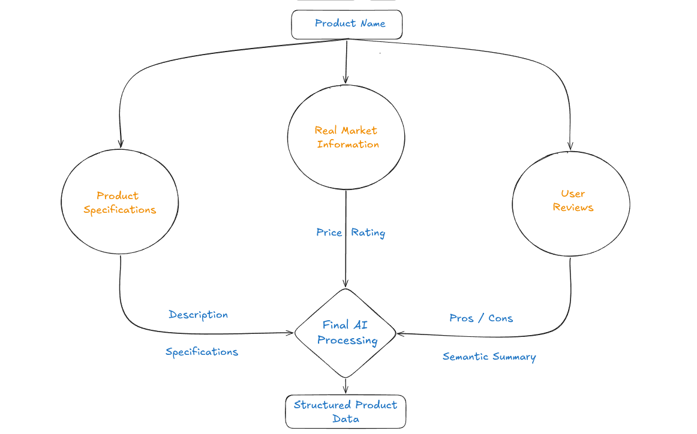

<div align="center">

# AIO-TECH

</div>

## Table of Contents

* [The Idea](#the-idea)
* [Ready Features](#ready-features)
* [API Endpoints](#api-endpoints)
* [Backend Architecture](#backend-architecture)
* [Database Design](#database-design)
* [Project Structure](#project-structure)
* [Tech Stack](#tech-stack)
* [Future Improvements](#future-improvements)

## The Idea

Choosing an electronics product can be difficult.

Traditional product platforms usually focus on **specifications, technical details, and marketing descriptions**. While this information is useful, it doesn't always answer the questions people actually care about:

* **Is this product really good to use every day?**
* **What problems do real users experience?**
* **What do people like and dislike about it?**
* **Does it actually satisfy my specific needs?**

**AIO-TECH** is an AI-powered platform designed to help solve this problem.

Instead of focusing only on raw specifications, AIO-TECH acts as an **AI assistant for electronics products** that helps users understand what people actually say about a product.

The platform collects **feedback, opinions, and reviews from people who have actually used the product**, particularly from social media and online discussions. It then uses AI to analyze this information and transform large amounts of unstructured user feedback into useful product insights.

For each product, AIO-TECH can identify and extract:

* **Pros** — the things users commonly like about the product.
* **Cons** — the problems and complaints users frequently mention.
* **Semantic Summary** — an AI-generated understanding of what people are actually saying and experiencing with a specific product.

The goal is to move beyond simply answering:

> **"What are the specifications of this product?"**

and instead help answer:

> **"What do real users think about this product?"**


---

## Ready Features

* Do AI research on a specific product.
* Find products based on a user's description.


### AI Research Pipeline

For each product, AIO-TECH performs an AI-powered research workflow.



The research pipeline collects information from multiple sources.

#### Market Information

Used to collect product market data such as:

* Product price
* Product rating
* Product image

#### Social Reviews

Researches and summarizes opinions and reviews about the product.

The goal is to identify:

* Common positive feedback
* Common negative feedback
* User experiences
* Frequently mentioned advantages and disadvantages

#### Product Description

Researches product specifications and generates useful product information and descriptions.

#### Final AI Processing

The results from the market information service, reviews agent, and description agent are combined and sent to a final LLM call.

The final LLM call generates a structured result that can be stored in the database.

---

### Semantic Product Search

AIO-TECH allows users to find products based on a **natural-language description** of what they are looking for.

For each product, the system stores an **embedding vector** generated from its:

* Description
* Pros
* Cons

When a user enters a description, AIO-TECH:

1. Converts the user's description into an embedding vector.
2. Compares it with the embedding vectors of stored products.
3. Calculates the **cosine distance** between the user's embedding and each product embedding.
4. Returns the products with the the **lowest distance**.

This allows users to search for products based on **meaning and requirements**, rather than only using exact product names or keywords.

---
## API Endpoints

### Data Endpoints

| Method | Endpoint                | Description                                           |
| ------ | ----------------------- | ----------------------------------------------------- |
| `POST` | `/data/insert_brand`    | Add a new product brand.                              |
| `POST` | `/data/insert_category` | Add a new product category.                           |
| `POST` | `/data/update_product`  | Research and update a product or create it if needed. |

### Product Search Endpoints

| Method | Endpoint              | Description                                                                  |
| ------ | --------------------- | ---------------------------------------------------------------------------- |
| `POST` | `/search/name`        | Find products with similar names.                                            |
| `POST` | `/search/description` | Find products based on a natural-language description using semantic search. |

---

## Backend Architecture

AIO-TECH follows a layered backend architecture to separate API logic, business logic, AI services, and database operations.

```text
                        ┌─────────────────┐
                        │     Client      │
                        └────────┬────────┘
                                 │
                                 ▼
                        ┌─────────────────┐
                        │   FastAPI API   │
                        │     Routes      │
                        └────────┬────────┘
                                 │
                                 ▼
                        ┌─────────────────┐
                        │   Controllers   │
                        │ Business Logic  │
                        └────────┬────────┘
                                 │
                    ┌────────────┴────────────┐
                    │                         │
                    ▼                         ▼
           ┌────────────────┐       ┌────────────────┐
           │   AI Services  │       │  Repositories  │
           │                │       │                │
           └───────┬────────┘       └───────┬────────┘
                   │                        │
                   ▼                        ▼
           ┌────────────────┐       ┌────────────────┐
           │   Embedding    │       │    Database    │
           │    Service     │       │   Operations   │
           │                │       │                │
           │    Research    │       │   SQLAlchemy   │
           │    Service     │       │                │
           │                │       │    pg_trgm     │
           │   AI Agents    │       │    pgvector    │
           └────────────────┘       └────────────────┘
```

---

## Database Design

The project uses **PostgreSQL** as the primary database, with **SQLAlchemy** as the ORM and **psycopg** as the PostgreSQL driver, with two extensions:
* pgvector — used to store product embedding vectors and perform vector similarity search.
* pg_trgm — used for fuzzy text search, such as finding products with similar names.


### Main entities include:

#### Brand

Stores product brands.

#### Category

Stores product categories.

#### Product

Stores researched product information, including:

* Product name
* Brand
* Category
* Description
* Pros
* Cons
* Price
* Rating
* Image
* Social review summary
* Embedding vector for the product description, pros, and cons
* Last update date

---

## Project Structure

```text
AIO-TECH/
│
├── Docker/
│   └── docker-compose.yml          # Docker services configuration
│
├── src/
│   │
│   ├── ai/                         # AI-related components
│   │   ├── agents/                 # AI agents for product research
│   │   ├── clients/                # LLM provider chat and embedding implementations
│   │   ├── services/               # AI services and workflow orchestration
│   │   ├── schemas/                # AI output schemas
│   │   ├── tools/                  # Tools used by AI agents
│   │   └── prompt_templates/       # Prompts used by AI agents
│   │
│   ├── controllers/                # Application and business logic
│   │
│   ├── database/                   # Database connection and configuration
│   │
│   ├── helpers/                    # Shared helper functions and utilities
│   │
│   ├── models/                     # Database models and data schemas
│   │   ├── pydantic_schemas/       # Pydantic schemas for data validation
│   │   ├── ProductModel.py         # Product database model
│   │   ├── BrandModel.py           # Brand database model
│   │   └── CategoryModel.py        # Category database model
│   │
│   ├── repositories/               # Database operations and data access
│   │   ├── ProductRepository.py    # Product database operations
│   │   ├── BrandRepository.py      # Brand database operations
│   │   └── CategoryRepository.py   # Category database operations
│   │
│   ├── routes/                     # FastAPI API routes and endpoints
│   │   ├── enums/                  # Response constants and result definitions
│   │   └── schemas/                # Pydantic schemas for API request and response validation
│   │
│   ├── main.py                     # Application entry point
│   ├── pyproject.toml              # Project dependencies and configuration
│   └── uv.lock                     # Locked Python dependencies
│
├── README.md                       # Project documentation
└── .gitignore                      # Git ignored files
```

---

## Tech Stack

| Technology        | Purpose                              |
| ----------------- | ------------------------------------ |
| **Python**        | Main programming language            |
| **FastAPI**       | Backend API                          |
| **SQLAlchemy**    | ORM and database operations          |
| **PostgreSQL**    | Relational database                  |
| **pgvector**      | Vector storage and similarity search |
| **pg_trgm**       | Fuzzy text search                    |
| **Google Gemini** | AI generation and embeddings         |
| **Google ADK**    | AI agent framework                   |
| **SerpAPI**       | Product market information           |
| **Docker**        | Database containerization            |
| **Pydantic**      | Data validation and schemas          |
| **uv**            | Python package management            |

---

## Future Improvements

Some planned improvements for the project include:

* Product comparison, allowing users to compare products.
* Product price history tracking.
* Finding the e-commerce website offering the lowest product price.
* Price alert notifications when a tracked product reaches a specific price threshold.
* Product recommendation system.
* More data sources.


